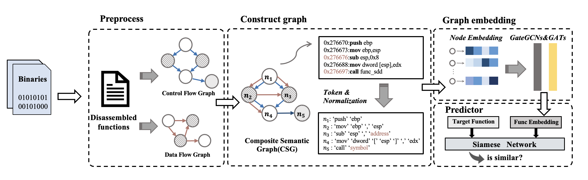

# Binary Software Similarity Detection with Graph Embedding

## Overview

This project focuses on detecting the similarity between binary software programs using graph embedding techniques. The core methodology involves preprocessing binary files to construct control flow and data flow graphs, combining them into composite semantic graphs, and then using graph embedding techniques to identify similarities between functions.

## Features

- **Binary File Analysis:** Disassemble binary files into functions.
- **Graph Construction:** Build control flow and data flow graphs.
- **Composite Semantic Graph:** Combine control flow and data flow into composite semantic graphs.
- **Graph Embedding:** Use GateGCNs and GATs for node embedding.
- **Similarity Detection:** Use a Siamese Network to detect similar functions and identify potential similarities between software programs.

## Installation

To use this project, you need to have Python installed. You can install the required dependencies using the following command